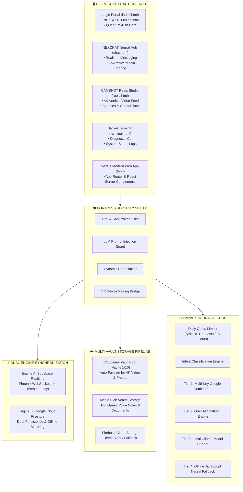
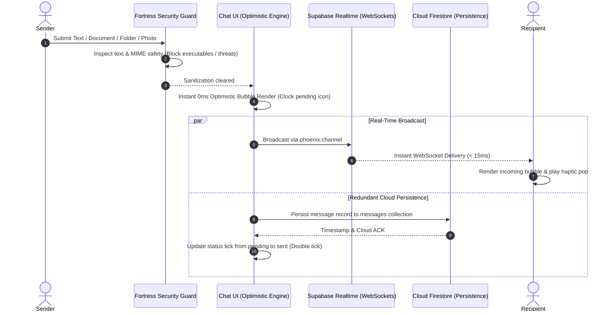
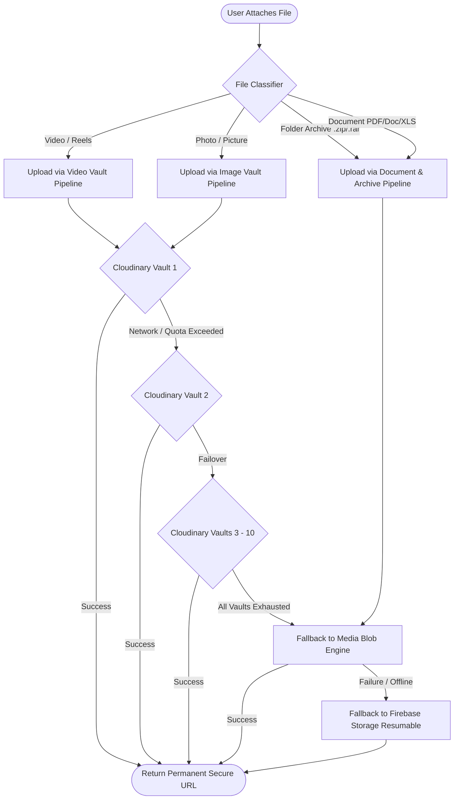
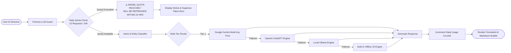

# ⚡ NEXSHOT // The Unified Next-Gen Cyber Ecosystem

[](https://github.com/alexhack235-code/NEXCHAT)
[](https://github.com/alexhack235-code/NEXCHAT)
[](https://github.com/alexhack235-code/NEXCHAT)
[](https://github.com/alexhack235-code/NEXCHAT)

> **`[ THE FUTURE IS RIGHT HERE ]`**  
> **NEXSHOT** represents the state-of-the-art technological convergence of **NEXCHAT** (Quantum-Encrypted Neural Messaging & Dual-Engine Real-Time Chat) and **CAMSHOT** (Pro Cinematic Reels, Multi-Vault Decentralized Storage & Studio Camera Tools).

---

## 🌟 The Convergence Formula

```text
 ┌───────────────────────────────────┐       ┌───────────────────────────────────┐
 │              NEXCHAT              │       │              CAMSHOT              │
 │  • Real-Time Neural Messaging     │   ✕   │  • 4K Studio Reels & Camera Tools │
 │  • Dual-Engine Realtime Sync      │       │  • Multi-Vault Cloud Storage Pool │
 │  • High-Speed Voice & Call Hub    │       │  • Interactive Creator Ecosystem  │
 └───────────────────────────────────┘       └───────────────────────────────────┘
                                   │           │
                                   ▼           ▼
                     ═════════════════════════════════════
                                   NEXSHOT
                     ═════════════════════════════════════
                     "THE FUTURE IS RIGHT HERE"
```

---

## 🏛️ Ecosystem Architecture Diagrams

### 1. High-Level System Architecture



---

### 2. Dual-Engine Real-Time Messaging Lifecycle



---

### 3. Multi-Vault Media Storage & Failover Architecture



---

### 4. ChronEX AI Intelligence Pipeline & Daily Rate Limiter



---

## 📁 Repository Directory Structure

```text
NEXCHAT/
├── index.html                   # Cyber Login Gate & NEXSHOT Fusion Cinematic Intro Overlay
├── login.css                    # Futuristic styling for login, streams, and fusion keyframes
├── auth.js                      # Authentication controller, Web Audio synthesizer & intro engine
├── chat.html                    # NEXCHAT core communication portal
├── chat.css                     # Comprehensive design system, cyberpunk chat styling & animations
├── chat.js                      # Chat engine: presence, attachments, typing, voice notes & DB sync
├── reels.html                   # CAMSHOT Studio: Vertical 4K creator reels & video playback
├── reels.css                    # Reels layout, responsive video swiper, bounties & creator drawer
├── reels.js                     # Reels player, feed ingestion, like/comment algorithms & sound hub
├── terminal.html                # Cyberpunk hacker terminal for diagnostics & real-time telemetry
├── landing.html                 # Product showcase, feature tours & interactive demonstrations
├── chronex-ai-service.js        # ChronEX AI Brain: Multi-tier LLM router & 10 req/day quota engine
├── messaging-features.js        # Auxiliary chat utilities: voice waveforms, reply previews, polls
├── firebase-config.js           # Firebase Client Initialization (Auth, Firestore, RTDB, Storage)
├── supabase-schema.sql          # PostgreSQL schema & Realtime publication setup for Supabase
│
├── src/
│   └── js/
│       ├── security-shield.js   # FORTRESS Security Guard (XSS, Injection & Sanitization)
│       ├── security-guard.js    # Device trust evaluation & anti-tamper safeguards
│       ├── cloudinary.js        # Multi-Vault Cloudinary Media Storage Pipeline (Vaults 1-10)
│       ├── media-upload.js      # Universal media upload orchestrator & blob wrappers
│       ├── reels-vault.js       # Dedicated storage management for CAMSHOT reels videos
│       ├── status-vault.js      # Ephemeral 24h status media storage management
│       ├── reels-sounds.js      # Soundtrack library & audio mixer for CAMSHOT reels
│       ├── supabase-chat.js     # Supabase Realtime broadcast client & message subscriber
│       ├── supabase-config.js   # Dynamic Supabase WebSocket configuration & connection tester
│       ├── presence.js          # Peer presence & real-time typing indicators
│       ├── livekit-call.js      # WebRTC voice/video calling integration via LiveKit
│       ├── link-device.js       # Multi-device synchronization via encrypted QR handshakes
│       └── wallpaper-presets.js # Dynamic cyberpunk wallpaper engine
│
├── app/                         # Next.js App Router (Full-Stack Modern Extension)
│   ├── layout.tsx               # Root Next.js layout & global theme hydration
│   ├── globals.css              # Universal design tokens and utility classes
│   ├── profile/page.tsx         # User profile manager, badges, token ledger
│   ├── reels/page.tsx           # Modern React-based reels stream
│   ├── status/page.tsx          # Status stories view
│   ├── upload/page.tsx          # Cloud video & poster upload workflow
│   └── api/
│       └── reels/route.ts       # Serverless REST endpoints for reels feed management
│
├── api/                         # Vercel Serverless Functions
│   ├── _security.js             # API request validation & signature checking
│   ├── ai.js                    # Server-side AI proxy
│   ├── reels.js                 # Reels ingestion handler
│   ├── upload.js                # Secure server-side media upload endpoint
│   └── serve-blob.js            # Media streaming proxy
│
└── components/                  # Reusable React & Web Components
    └── NEXLogo.tsx              # Dynamic Vector Brand Emblem
```

---

## ⚡ Core Feature Modules

### 1. 💬 NEXCHAT Neural Messaging
* **Dual-Engine Realtime Synchronization:** Combines the sub-15ms WebSocket speed of Supabase with the resilient offline-first persistence of Google Cloud Firestore.
* **Universal File & Document Sharing:** Native pipeline supporting pictures (`.jpg`, `.png`, `.webp`), compressed folder archives (`.zip`, `.rar`, `.tar`, `.7z`), documents (`.pdf`, `.docx`, `.xlsx`, `.txt`), and voice notes up to 50MB.
* **Interactive Media Cards:** High-definition photo viewers, gold-badged folder archive download containers, and document preview chips.
* **Multi-Device Link Pairing:** Instant QR-code device linking with cryptographic token handshakes.

### 2. 🎬 CAMSHOT 4K Creator Reels
* **Next-Gen Reels Experience:** Smooth vertical feed navigation with hardware-accelerated transitions.
* **Multi-Vault Cloud Pipeline:** Zero-backend upload architecture sequentially rotating across multiple storage vaults for 99.99% availability.
* **Creator Bounty & Monetization Hub:** Token reward mechanics for creator engagement and viral trends.
* **Soundtrack Studio:** Integrated audio mixing with custom sound overlays.

### 3. ✨ NEXSHOT Fusion Cinematic Intro
* **Visual Convergence:** Cinematic intro overlay on the login portal where **NEXCHAT** (Cyan/Emerald stream) and **CAMSHOT** (Gold/Iris stream) collide at a central singularity to manifest **NEXSHOT**.
* **Tagline:** `[ THE FUTURE IS RIGHT HERE ]`
* **Zero-Asset Web Audio Synthesizer:** Pure mathematical frequency synthesis producing ambient start chimes, sub-bass collision impacts, and harmonic quantum chords.
* **User Control:** One-click Skip Intro button, audio mute toggle, session memory, and an on-demand Replay trigger.

### 4. 🤖 ChronEX AI Brain
* **10 Requests/Day Rate Limit:** Rolling 24-hour window quota enforcement. If a user exceeds the daily threshold, the model gracefully informs:
  > `MODEL QUOTA REACHED ! WILL BE REFRESHED WITHIN 24 HRS`
* **Multi-Tier Model Routing:** Sequential automatic failover across Google Gemini, OpenAI ChatGPT, Local Ollama, and offline rule-based neural modules.

### 5. 🛡️ FORTRESS Security Shield
* **Pre-Flight Sanitization:** Scans all outbound chat messages and incoming directives against XSS payloads and malicious code injection.
* **LLM Guard:** Blocks jailbreaks and prompt injection attempts before queries reach the AI brain.
* **Anti-Executable Filter:** Automatically rejects dangerous executable binaries (`.exe`, `.bat`, `.cmd`, `.sh`, `.msi`) from attachment queues.

---

## ⚙️ Environment Configuration

Copy `.env.example` to `.env` and populate with your own project credentials:

```bash
cp .env.example .env
```

### Sanitized `.env.example` Specification

```ini
# ChronEX AI Configuration
AI_PROVIDER=gemini
GEMINI_API_KEY_1=<your_primary_gemini_api_key>
GEMINI_API_KEY_2=<your_secondary_gemini_api_key>
OPENAI_API_KEY=<your_openai_api_key_optional>
AI_TEMPERATURE=0.7
AI_MAX_TOKENS=2048

# Multi-Vault Storage (Cloudinary Unsigned Credentials)
CLOUDINARY_CLOUD_NAME=<your_cloudinary_cloud_name>
CLOUDINARY_UPLOAD_PRESET=<your_unsigned_upload_preset>

# Vercel Blob Storage Tokens (Optional Fallback)
BLOB_READ_WRITE_TOKEN=<your_vercel_blob_token>
BLOB_READ_WRITE_TOKEN_MEDIA=<your_media_blob_token>

# Application Config
PORT=3000
DEBUG=false
```

> 🔒 **Security Notice:** Never commit `.env` or personal credentials to public source control. Keep `.gitignore` updated.

---

## 🚀 Getting Started

### Option A: Static Web Application (Zero-Build)
NEXCHAT is designed to run directly on any static web server without build steps:

```bash
# Using Python
python -m http.server 3000

# Using Node.js live-server
npx serve -l 3000
```
Navigate to `http://localhost:3000/index.html` to experience the login gate and the **NEXSHOT** fusion animation.

### Option B: Modern Next.js Full-Stack App
```bash
# Install dependencies
npm install

# Start Next.js development server
npm run dev
```
Navigate to `http://localhost:3000` to interact with the App Router interface.

---

## 📄 License & Attribution

* **Architected & Engineered by:** **NEXO-TECH** & **NEXCHAT Dev Teams**
* **Branding:** NEXCHAT, CAMSHOT, and NEXSHOT are proprietary original marks of the project.
* **License:** [MIT License](LICENSE) (or Private Workspace License)
